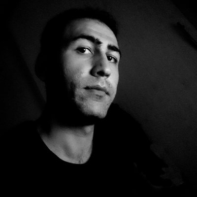

MSc. Student in the Department of <abbr title="Computer Education and Instructional Technology">CEIT</abbr> at Amasya University.

<h4>Who I am </h4>

My name is Emre. I am currently a MSc. student in the Department of Computer Education and Instructional Technology at Amasya University, Turkey 🏫. My master thesis is focused on computational thinking 🔭. During the thesis term I try to develop the web app, which is a reliable and valid to measure high school students' computational thinking skills 🔬. Also I make scientific studies on computer science education 🔍.

I graduated from industrial vocational high school, where I studied in the branch of web programming 🎓. While I was in high school, I worked as a web developer intern. Although I started developing websites in 2006, I got my first job in 2012 💼. In the past, I have worked on websites, android apps, and web based internal systems for some of the small software companies and clients 🖥️. My main experience is in back and front ends development with using the operations of CRUD 🔑. Also I can make this happen for your business as well, don’t hesitate to get in touch 📭.

I live in Samsun, Turkey 🌿 and enjoy spending my free time reading scientific book & article and novel 📚, hanging out with friends as an asocial 🥂, learning new things about software development ✍️, watching TV series in English as my second language 📺, listening to loud music 🎶, and  surfing on the internet 🌐.

* 🏃 I'm currently working on PHP, MySQL, Bootstrap.
* ✨ I'm currently learning Flutter, Dart.
* 💬 Ask me about Android Development, PHP, Bootstrap.
<h4>Last posts</h4>
<ul>
   
    
        
        <li>{{ post.date | date: "%b %e, 20%y" }} &middot; <a href="{{ site.url }}{{ post.url }}">{{ post.title }}</a></li>
        
       

</ul>

****
<h4>Experience</h4>
<h6><i class="fa fa-building"></i> <b>Samsun Vocational and Technical HS</b></h6>
<h6 class="mb-2 p-0"><i class="fa fa-id-card" aria-hidden="true"></i> <b>Computer Teacher Intern</b></h6>
<h6 class="mb-2 p-0 font-weight-normal"><i class="fa fa-info-circle"></i> Sep 2017 – May 2018 &middot; Samsun, Turkey</h6>
<h6 class="mb-2 p-0 font-weight-normal text-info"><i class="fa fa-link" aria-hidden="true"></i> <em>for bachelor's degree.</em></h6>

I taught high school students about Arduino and evaluated the students' work.

<h6><i class="fa fa-building"></i> <b>Side Internet ve Bilisim Teknolojileri</b></h6>
<h6 class="mb-2 p-0"><i class="fa fa-id-card" aria-hidden="true"></i> <b>Web Developer Intern</b></h6>
<h6 class="mb-2 p-0 font-weight-normal"><i class="fa fa-info-circle"></i> Jun 2014 – Aug 2014 &middot; Samsun, Turkey</h6>
<h6 class="mb-2 p-0 font-weight-normal text-info"><i class="fa fa-link" aria-hidden="true"></i> <em>for associate degree.</em></h6>

I converted the designs in the format of PSD or PNG to HTML/CSS, and then coded in Classic ASP.

<h6><i class="fa fa-building"></i> <b>Kayrasoft Yazilim ve Bilisim Teknolojileri</b></h6>
<h6 class="mb-2 p-0"><i class="fa fa-id-card" aria-hidden="true"></i> <b>Web Developer</b></h6>
<h6 class="mb-2 p-0 font-weight-normal"><i class="fa fa-info-circle"></i> Jul 2013 – Apr 2014 &middot; Samsun, Turkey</h6>

I converted the designs in the format of PSD or PNG to HTML/CSS, and then developed corporate websites in Classic ASP. During the developing I used JavaScript and jQuery for effective results. For the database operations I used MySQL and MS Access. The websites I developed are programmed for simple operations such as presenting brand identity. Therefore, most of the time I worked on the operations of CRUD. Also I helped interns to develop websites.

<h6><i class="fa fa-building"></i> <b>KA Bilisim Teknolojileri</b></h6>
<h6 class="mb-2 p-0"><i class="fa fa-id-card" aria-hidden="true"></i> <b>Web Developer Intern</b></h6>
<h6 class="mb-2 p-0 font-weight-normal"><i class="fa fa-info-circle"></i> Jun 2012 – Nov 2012 &middot; Samsun, Turkey</h6>
<h6 class="mb-2 p-0 font-weight-normal text-info"><i class="fa fa-link" aria-hidden="true"></i> <em>for high school degree.</em></h6>

I converted the designs in the format of PSD or PNG to HTML/CSS, and then developed corporate websites in Classic ASP. During the developing I used JavaScript and jQuery for effective results. For the database operations I used MySQL, MSSQL and MS Access. The websites I developed are programmed for simple operations such as presenting brand identity. Therefore, most of the time I worked on the operations of CRUD. Outside of that I worked on a few projects for ministry and governorship. In one of the projects, the construction projects in Turkey were followed. In the other project, women's health in all of the city were followed.

<h6><i class="fa fa-building"></i> <b>@localhost</b></h6>
<h6 class="mb-2 p-0"><i class="fa fa-id-card" aria-hidden="true"></i> <b>freelance software developer</b></h6>
<h6 class="mb-2 p-0 font-weight-normal"><i class="fa fa-info-circle"></i> 2006 – Present &middot; Everywhere</h6>

Anything can happen at any moment.

****
<h4>Education</h4>
<h6><i class="fa fa-university"></i> <b>Amasya University</b></h6>
<h6 class="mb-2 p-0"><i class="fa fa-graduation-cap" aria-hidden="true"></i> <b><abbr title="Computer Education and Instructional Technology">CEIT</abbr></b> &middot; <em class="text-success font-weight-normal">GPA: 3,66 / 4</em></h6>
<h6 class="mb-2 p-0"><i class="fa fa-level-up" aria-hidden="true"></i> <b>Master of Science</b></h6>
<h6 class="mb-2 p-0 text-info"><i class="fa fa-paperclip" aria-hidden="true"></i> <b>Web App to Measure <abbr title="Computational Thinking">CT</abbr> Skills</b></h6>
<h6 class="mb-2 p-0 text-success"><i class="fa fa-user" aria-hidden="true"></i> <em>Advisor: Prof. Dr. Özgen KORKMAZ</em></h6>
<h6 class="mb-2 p-0 font-weight-normal"><i class="fa fa-info-circle"></i> 2018 – Present &middot; Amasya, Turkey</h6>

:books: Lessons learned:

* Scientific Methods
* IBM SPSS

<h6><i class="fa fa-university"></i> <b>Ondokuz Mayıs University</b></h6>
<h6 class="mb-2 p-0"><i class="fa fa-graduation-cap" aria-hidden="true"></i> <b><abbr title="Computer Education and Instructional Technology">CEIT</abbr></b> &middot; <em class="text-success font-weight-normal">GPA: 3,43 / 4</em></h6>
<h6 class="mb-2 p-0"><i class="fa fa-level-up" aria-hidden="true"></i> <b>Bachelor of Science</b></h6>
<h6 class="mb-2 p-0 text-info"><i class="fa fa-paperclip" aria-hidden="true"></i> <b>Android Application for Disabled People</b></h6>
<h6 class="mb-2 p-0 text-success"><i class="fa fa-user" aria-hidden="true"></i> <em>Advisor: Dr. Polat ŞENDURUR</em></h6>
<h6 class="mb-2 p-0 font-weight-normal"><i class="fa fa-info-circle"></i> 2016 – 2018 &middot; Samsun, Turkey</h6>

:books: Lessons learned:

* Educational Psychology
* Educational Assessment
* Instructional Design
* Adobe Illustrator
* Microsoft Access
* Microsoft Kudo
* MIT Scratch
* IBM SPSS
* Computer Hardware

<h6><i class="fa fa-university"></i> <b>Ondokuz Mayıs University</b></h6>
<h6 class="mb-2 p-0"><i class="fa fa-graduation-cap" aria-hidden="true"></i> <b>Computer Programming</b> &middot; <em class="text-success font-weight-normal">GPA: 3,46 / 4</em></h6>
<h6 class="mb-2 p-0"><i class="fa fa-level-up" aria-hidden="true"></i> <b>Associate of Science</b></h6>
<h6 class="mb-2 p-0 text-info"><i class="fa fa-paperclip" aria-hidden="true"></i> <b><abbr title="Content Management System">CMS</abbr> for Values Education</b></h6>
<h6 class="mb-2 p-0 font-weight-normal"><i class="fa fa-info-circle"></i> 2013 – 2015 &middot; Samsun, Turkey</h6>

:books: Lessons learned:

* Python
* Java
* C
* C#
* HTML/CSS
* JavaScript
* MySQL/SQL
* Pseudocode and Flowchart
* Autodesk 3ds Max
* Computer Networking

<h6><i class="fa fa-university"></i> <b>Atakum Vocational and Technical HS</b></h6>
<h6 class="mb-2 p-0"><i class="fa fa-graduation-cap" aria-hidden="true"></i> <b>Web Programming</b> &middot; <em class="text-success font-weight-normal">GPA: 73,01 / 100</em></h6>
<h6 class="mb-2 p-0"><i class="fa fa-level-up" aria-hidden="true"></i> <b>High School</b></h6>
<h6 class="mb-2 p-0 text-info"><i class="fa fa-paperclip" aria-hidden="true"></i> <b>Program to Control PC via SMS</b></h6>
<h6 class="mb-2 p-0 font-weight-normal"><i class="fa fa-info-circle"></i> 2009 – 2013 &middot; Samsun, Turkey</h6>

:books: Lessons learned:

* ASP.Net
* C#
* MSSQL
* Pseudocode and Flowchart
* HTML/CSS
* Microsoft Visual Studio
* Microsoft Excel
* Microsoft Access
* Microsoft Word
* Adobe Flash
* Adobe Dreamvewaer
* Adobe Fireworks
* Computer Networking
* Computer Hardware

****
<h4>Publication</h4>

Çoban, E., & Korkmaz, Ö. (2021). An alternative approach for measuring computational thinking: Performance-based platform. <em>Thinking Skills and Creativity</em>, 42, 100929. <a target="_blank" href="https://doi.org/10.1016/j.tsc.2021.100929">https://doi.org/10.1016/j.tsc.2021.100929</a>

Erdoğmuş, C., Çoban, E., Korkmaz, Ö., & Özden, M. Y. (2020). Technological Formation Scale for Teachers (TFS): Development and Validation. <em>Participatory Educational Research</em>, 8(2), 260-279. <a target="_blank" href="https://doi.org/10.17275/per.21.39.8.2">https://doi.org/10.17275/per.21.39.8.2</a>

Çoban, E., Korkmaz, Ö., Çakır, R. <em>et al.</em> Attitudes of IT teacher candidates towards computer programming and their self-efficacy and opinions regarding to block-based programming. <em>Educ Inf Technol</em> 25, 4097–4114 (2020). <a target="_blank" href="https://doi.org/10.1007/s10639-020-10164-w">https://doi.org/10.1007/s10639-020-10164-w</a>

Erdoğmuş, C., Çoban, E. ve Korkmaz, Ö. (2019, October). Technological Formation Levels of Teachers and Teacher Candidates. Ş. Şentürk (Ed.), In Ondokuz Mayıs University International 100th Year Education Symposium (s. 90). Samsun: Ondokuz Mayıs University. <a target="_blank" href="http://u100es.omu.edu.tr/">http://u100es.omu.edu.tr/</a>

****
<h4>Accomplishment</h4>
<h6 class="text-warning"><i class="fa fa-star" aria-hidden="true"></i> <b>Scholarship</b></h6>
<h6 class="mb-2 p-0 text-info"><i class="fa fa-info-circle"></i> Suna ve İnan Kıraç Foundation &middot; 2019</h6>

<h6 class="text-warning"><i class="fa fa-star" aria-hidden="true"></i> <b>Honor Student</b></h6>
<h6 class="mb-2 p-0 text-info"><i class="fa fa-info-circle"></i> Ondokuz Mayıs University &middot; 2015</h6>

<h6 class="text-warning"><i class="fa fa-star" aria-hidden="true"></i> <b>Languages</b></h6>
<h6 class="mb-2 p-0 text-info"><i class="fa fa-info-circle"></i> English (Limited working proficiency)</h6>
- I can write in English with help from the dictionary. I'm not good at speaking and listening in English. However, I can introduce myself, a product, or something like that, and go abroad and live. Also I've written a scientific article in English before.
<h6 class="mb-2 p-0 text-info"><i class="fa fa-info-circle"></i> Turkish (Native)</h6>
